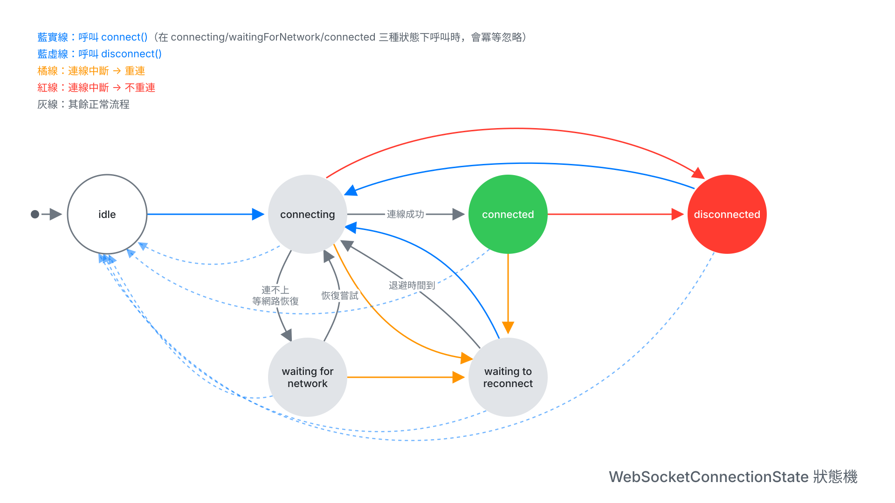

# SJWebSocketKit

WebSocket 傳輸層套件：連線、心跳、退避重連、訊息收發。

- 平台：iOS 15+／macOS 12+

## 安裝

Swift Package Manager：

```swift
.package(url: "https://github.com/jack51606/SJWebSocketKit.git", from: "0.1.0")
```

## 使用

```swift
import SJWebSocketKit

let endpoint = WebSocketEndpoint(host: "example.com", port: 443)

// 一個 WebSocket 服務對應一顆 manager
let manager = WebSocketManager(endpoint: endpoint)

// 連線狀態（idle／connecting／connected／waitingForNetwork／waitingToReconnect／disconnected）
manager.connectionStatePublisher
    .sink { state in /* ... */ }
    .store(in: &subscriptions)

// 收訊
manager.messagePublisher
    .sink { data, type in /* ... */ }
    .store(in: &subscriptions)

// 啟動連線
manager.connect()

// 送訊（訊息成功交給傳輸層就會進 completion）
manager.sendMessage(payload, type: .text)
    .sink(receiveCompletion: { _ in }, receiveValue: {})
    .store(in: &subscriptions)

// 關閉連線
manager.disconnect()
```

## 行為

- 連線中斷時，預設會啟動指數退避重連
- 可指定哪些中斷原因不重連
- 參數與預設值見 `WebSocketEndpoint` 與 `WebSocketManagerConfiguration` 的文件註解

## App 生命週期

kit 不監聽 app 生命週期，使用端需自行處理前景與背景的切換。

- 進背景時呼叫 `disconnect()`：SwiftUI 的 `ScenePhase.background`，UIKit 的 `UIApplication.didEnterBackgroundNotification`
- 回前景時呼叫 `connect()`：SwiftUI 的 `ScenePhase.active`，UIKit 的 `UIApplication.didBecomeActiveNotification`

app 在背景被暫停後，系統遲早會中斷連線，主動關閉可確保回到前景時呼叫 `connect()` 會立即重連。

## 狀態機

<picture>
  <source media="(prefers-color-scheme: dark)" srcset="docs/WebSocketConnectionState-dark.svg">
  
</picture>
